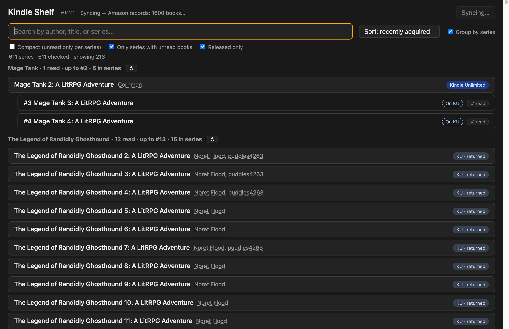
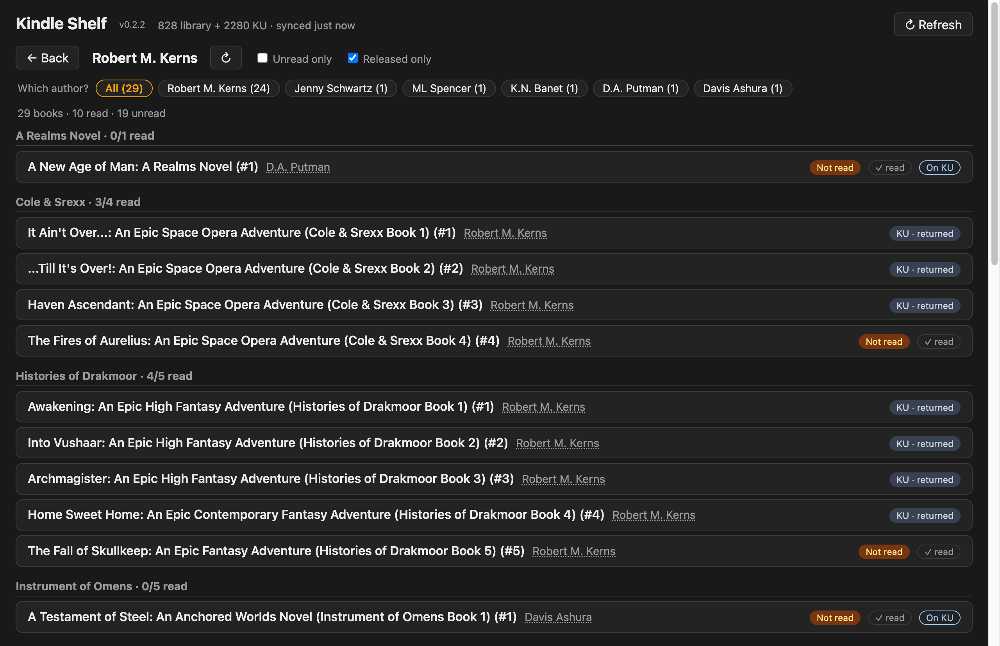
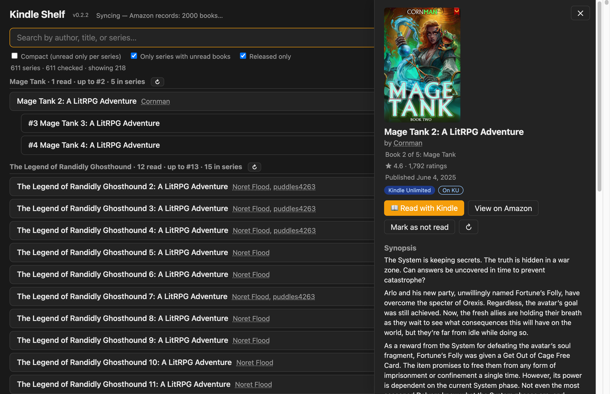
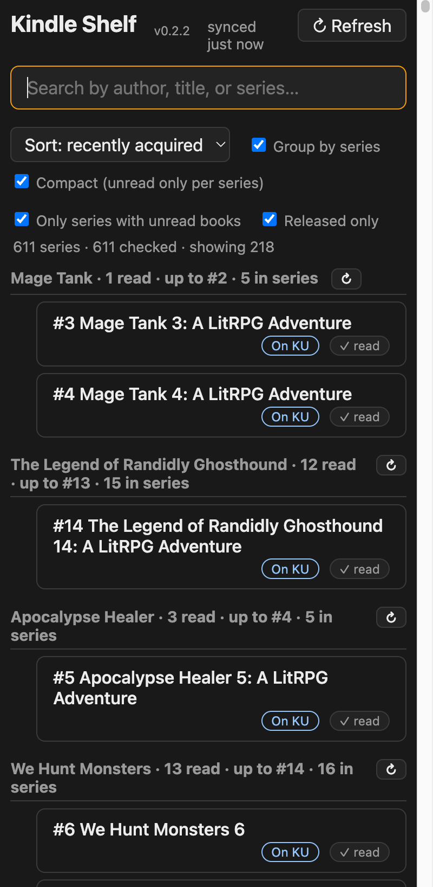

# Kindle Shelf

Answer "have I already read this author on Kindle?" — covers owned books **and**
Kindle Unlimited borrows, including returned ones.



## Why

I've had a long-standing annoyance with the Amazon Kindle app: I read a lot
of book series, and in its "Continue series you've started" view I have to
wade through a list of not-yet-released books to find ones I can actually
read — with no way to sort or filter any of it. Kindle Shelf is the view I
wanted instead: every series I've started with the unread volumes listed,
pre-orders filtered out by default, sortable and searchable, plus quick
answers to "have I already read this author?" before borrowing something
that only sounds new.

Amazon has no official API for your personal library, so this is a small
Electron app: the embedded browser is where you sign in to Amazon (session
persists inside the app), and syncs hit Amazon's internal JSON endpoints
through the app's own Chromium network stack:

- **Owned/active books** — the endpoint behind `read.amazon.com/kindle-library`.
- **KU borrows (current + returned)** — the Content & Devices (`/hz/mycd`)
  ajax endpoint, filtered to KindleUnlimited.

Catalog data (series contents, author catalogs, product details) comes from
Amazon HTML pages fetched through a hidden window in the same session —
a bare HTTP client trips Amazon's bot verification; a real renderer doesn't.

## Install

Download the latest build for your platform from
[Releases](https://github.com/wr0ngway/kindle-shelf/releases) — the app is
self-contained, no other dependencies needed. Everything (your Amazon
session, book data, caches) stays on your machine.

> **macOS note:** builds are not notarized, so Gatekeeper reports the
> downloaded app as "damaged". After moving it to Applications, clear the
> quarantine flag once, then it opens normally:
>
> ```sh
> xattr -cr "/Applications/Kindle Shelf.app"
> ```

Or run from source:

```sh
npm install
npm start
```

## Usage

- First launch: click **Sign in to Amazon**, log in (2FA included) in the
  embedded window. It closes itself once the session works, then syncs.
- Every launch auto-syncs, so data stays fresh; **↻ Refresh** re-syncs on
  demand mid-session.

**Library view** — search by author/title/series; sort A–Z or by most
recently acquired. *Group by series* (series inferred from titles, refined
by product metadata as it's cached) unlocks the series tools: each series
page is fetched from Amazon automatically in the background after every sync
(first launch scans everything), listing unread volumes inline (*Released
only* on by default so pre-orders don't clutter); *Only series with unread
books* narrows to series you're behind on, and *Compact* hides your own
books to leave just the what-to-read-next queue. Series checks cache for a
week; the header ↻ Refresh re-syncs and re-scans (and stops a running scan);
per-series ↻ re-checks one series.
Control states persist across launches — "group + compact + recent + unread
only" is the reading-queue view. Badges: *Owned*, *Kindle Unlimited* (active
borrow), *KU · returned*, reading progress, *✓ Finished* (Amazon's read
mark).

**Author drill-down** — click any author name to fetch their full Kindle
catalog, grouped by series, with read/unread badges. Filters: *Unread only*,
*Released only*. If the search mixes several same-named authors, chips let
you pick the one you meant.



**Read status** — presence in your library counts as read; Amazon's own
read-state record (the Kindle apps' "Mark as read") is imported on every
sync and is authoritative. Marking read/unread in the app pushes to Amazon;
only what Amazon can't represent (explicit unread, books never acquired
there) is kept as a local override, pruned automatically once Amazon's
record supersedes it.

**Book details** — click any book row: cover, synopsis, rating, reviews,
release date, and **📖 Read with Kindle** (opens the book in an embedded
Kindle Cloud Reader window) or **View on Amazon**.



Data, caches, and the Amazon session live under
`~/Library/Application Support/kindle-shelf/` (`books.json`, `cache/`,
`raw/` for debugging). Delete the directory to log out / reset.

## Always-on / menu bar

Kindle Shelf keeps running when you close the window (so remote access and
background scans stay up) — a book icon lives in the menu bar / system tray
with **Open**, **Sync now**, **Start at login**, **Hide Dock icon** (macOS),
and **Quit**. Closing the window hides it; quit from the tray menu or Cmd+Q.

## Remote access (phone)



Click the 📱 button to serve the same app to your phone's browser. Access is
gated by a persistent random token: scan the QR code once (it encodes the URL
with the token), and the phone exchanges it for a long-lived cookie — no
sign-in after that. "Add to Home Screen" gives an app-like launch.
Regenerating the token revokes every device.

With [Tailscale](https://tailscale.com) installed, one button runs
`tailscale serve` to add a stable `https://…ts.net` address that works from
anywhere on your tailnet (and only your tailnet) with a trusted certificate —
which also unlocks full PWA install on Android. Without it, the QR uses your
LAN address (same Wi-Fi only). The panel walks through the whole setup
(download links, sign-in, phone app QR) if Tailscale isn't installed yet.

> **First-time Serve approval:** the first HTTPS enable opens Tailscale's
> "Start using Serve" page. Keep **HTTPS certificates** checked. The
> pre-checked **"Tailscale Funnel (optional)"** grants your tailnet the
> ability to publish services to the public internet — Kindle Shelf never
> uses Funnel and stays tailnet-only either way, so uncheck it unless you
> want that capability for other things.

Amazon sign-in stays desktop-only; the phone is a client of the desktop app's
session. Don't port-forward the remote port to the public internet — the
server fronts your Amazon session. LAN + Tailscale is the intended posture.

## Dev helpers

`probe.js` and `test-parse.js` run one-off fetches/parses against the live
session (`npx electron probe.js`) — useful when Amazon changes page shapes.
`test-browser.js` simulates a phone browser against the remote server;
`gen-icons.js` regenerates the PWA icons.

## Caveats

- Amazon only retains KU borrow history for your **current** subscription
  stretch — if you cancelled and re-subscribed, older borrows are gone from
  the site. The only recovery is Amazon's **Account → Request My Data**
  export, which also includes per-book reading sessions.
- "In my library / borrowed" ≈ "read" only if you finish what you acquire;
  reading progress isn't exposed by these endpoints.
- The endpoints are unofficial and could change shape — raw responses in
  `raw/` make re-adapting easy.
